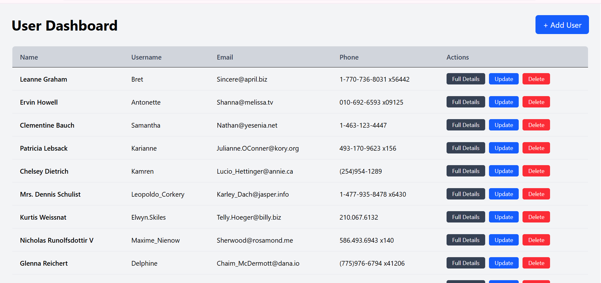
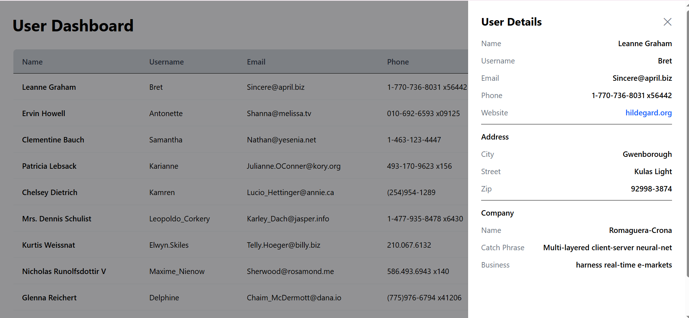
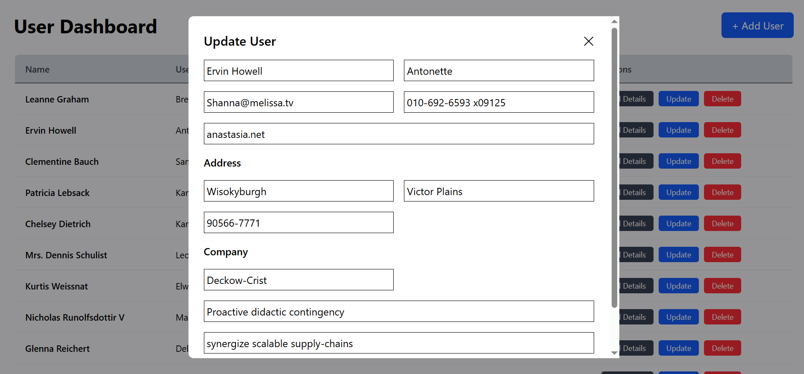

# React Redux User Management Dashboard

A  **User Management Dashboard** built with **React, Redux Toolkit, and Tailwind CSS**. This project demonstrates clean CRUD architecture, proper state separation, and real-world UI patterns (tables, modals, side panels).

---

## 🚀 Features

### Core Functionality

* Fetch users from API (Redux async thunk)
* Display users in a responsive table
* Add new users (Modal form)
* Update existing users (Prefilled modal form)
* Delete users
* View full user details in a side card

### UI / UX

* Tailwind CSS styling (no inline CSS)
* Responsive layout (desktop & mobile)
* Modal-based forms (Add / Update)
* Side drawer for detailed view
* Clean admin-dashboard layout

### Architecture

* Redux Toolkit for state management
* Local UI state for modals & drawers
* Reusable components
* Single form component for Add + Update

---

## 🧱 Tech Stack

* **React** (Functional Components + Hooks)
* **Redux Toolkit** (createSlice, createAsyncThunk)
* **Tailwind CSS**
* **JavaScript (ES6+)**

---

## 📂 Project Structure

```
src/
│
├── components/
│   ├── UsersTable.jsx        # Users table with actions
│   ├── UserForm.jsx          # Add / Update modal form
│   ├── UserDetailsCard.jsx   # Side drawer with full details
│
├── features/
│   └── users/
│       └── usersSlice.js     # Redux slice (fetch/add/update/delete)
│       └── usersService.js     # API calling
|       
│
├── pages/
│   └── Dashboard.jsx         # Main dashboard page
│
├── app/
|    └── store.js                  # Redux store
├── index.css                 # Tailwind + shared styles
└── main.jsx
└── app.jsx
```

---

## 🔄 Data Model (User)

```js
{
  id: number,
  name: string,
  username: string,
  email: string,
  phone: string,
  website: string,
  address: {
    city: string,
    street: string,
    zipcode: string
  },
  company: {
    name: string,
    catchPhrase: string,
    bs: string
  }
}
```

---

## 🔄 Setup
```
Required node.js install in system
git clone https://github.com/hs024/People_details
cd People_details
npm install
npm run dev

```

## Application Preview







#### Made by Himanshu Sharma
 